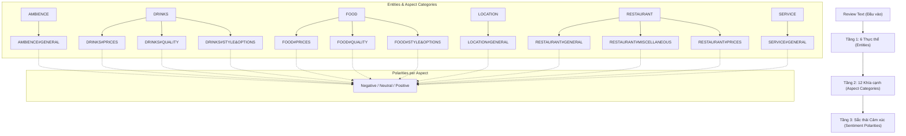
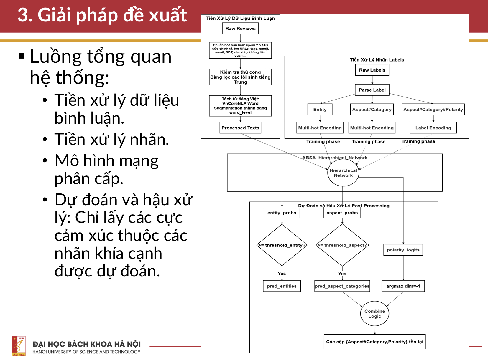
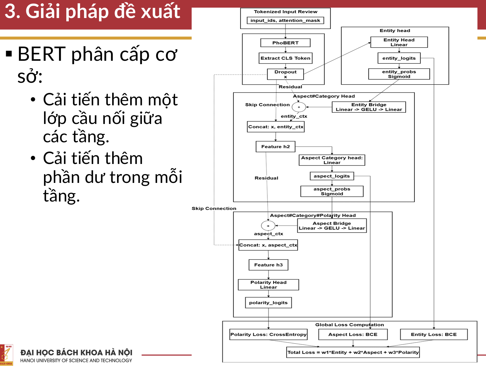
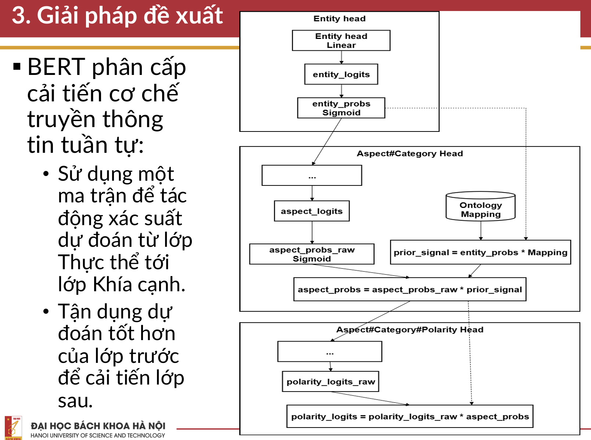
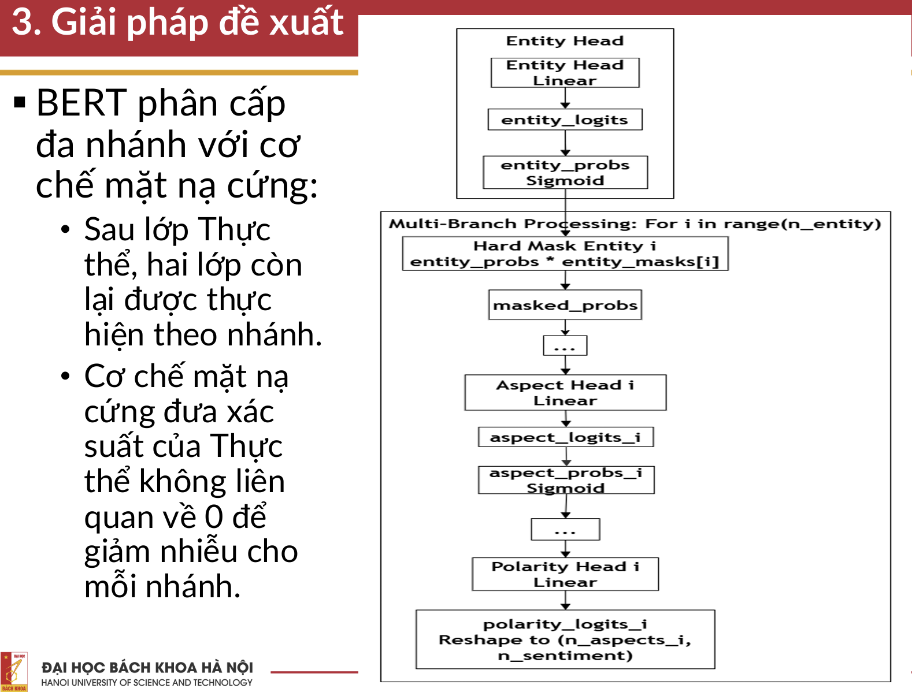
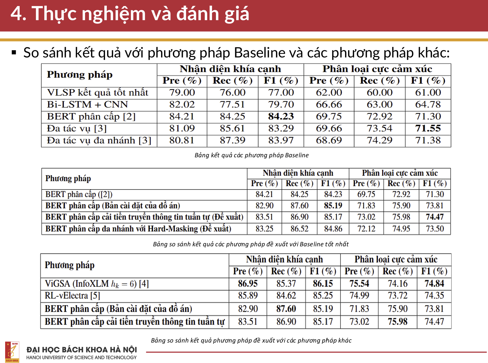

# ABSA_VLSP2018_RESTAURANT: Hierarchical Aspect-Based Sentiment Analysis

[](https://www.python.org/)
[](https://pytorch.org/)
[](https://huggingface.co/)
[](https://github.com/ds4v/absa-vlsp-2018)

Dự án triển khai và nghiên cứu các giải pháp cho bài toán **Phân tích Cảm xúc theo Khía cạnh (Aspect-Based Sentiment Analysis - ABSA)** dạng đa nhãn đa nhiệm (Multi-label Multi-task) trên tập dữ liệu đánh giá nhà hàng **VLSP 2018 (Restaurant Domain)**. Dự án sử dụng mô hình ngôn ngữ tiền huấn luyện **PhoBERT (`vinai/phobert-base`)** làm bộ mã hóa đặc trưng, kết hợp với các kỹ thuật **Phân loại phân cấp sâu (Hierarchical Classification)** nhằm truyền dẫn thông tin ngữ nghĩa có cấu trúc từ mức độ thực thể đến mức độ khía cạnh và cảm xúc chi tiết.

---

## 1. Giới thiệu Bài toán (Problem Formulation)

Bài toán ABSA trong tập dữ liệu VLSP 2018 yêu cầu: Từ một câu nhận xét (review) bằng tiếng Việt của khách hàng, mô hình phải đồng thời xác định:
1. **Thực thể (Entity)**: `AMBIENCE`, `DRINKS`, `FOOD`, `LOCATION`, `RESTAURANT`, `SERVICE` (Tổng cộng 6 thực thể).
2. **Khía cạnh cụ thể (Aspect Category - AC)**: Gồm 12 cặp Entity#Attribute.
3. **Sắc thái cảm xúc (Sentiment Polarity)**: `Positive` (Tích cực), `Negative` (Tiêu cực), `Neutral` (Trung tính) tương ứng với từng khía cạnh được phát hiện.

### Ví dụ minh họa:

> **Review**: *"Nhà hàng này nước uống rẻ, tuy nhiên thức ăn chưa được ngon, wifi thì tạm được, lúc nhanh lúc chậm"*
>
> -> **Output Dự đoán**:
> - `{ DRINKS#PRICES: POSITIVE }`
> - `{ FOOD#QUALITY: NEGATIVE }`
> - `{ RESTAURANT#MISCELLANEOUS: NEUTRAL }`

---

## 2. Không gian Nhãn Phân cấp (Hierarchical Label Space)

Không gian nhãn được tổ chức theo cấu trúc hình cây gồm 3 tầng phân cấp rõ rệt:



---

## 3. Kiến trúc Mô hình & Các Phương pháp Đề xuất

### 3.1. Luồng Tổng quan Hệ thống (Overall System Workflow)

<div align="center">
  
</div>

---

### 3.2. Ba Phương pháp Cải tiến của Mô hình BERT Phân cấp

Dự án kế thừa và phát triển 3 biến thể kiến trúc phân cấp dựa trên PhoBERT:

#### 1. Phương pháp 1: Cải tiến BERT phân cấp gốc (`source_code/best-hier-bert-origin.ipynb`)

<div align="center">
  
</div>

#### 2. Phương pháp 2: Improved 1 - Cải tiến cơ chế truyền thông tin tuần tự dựa trên Phương pháp 1 (`source_code/bert-hier-best-improved-1.ipynb`)

<div align="center">
  
</div>

#### 3. Phương pháp 3: Improved 2 - Đa nhánh với cơ chế mặt nạ cứng dựa trên Phương pháp 1 (`source_code/bert-hier-best-improved-2.ipynb`)

<div align="center">
  
</div>
---

## 4. Cấu trúc Thư mục (Repository Structure)

```text
.
├── dataset/                                   # Dữ liệu gốc VLSP 2018 Restaurant
│   ├── 1-VLSP2018-SA-Restaurant-train.txt     # Tập huấn luyện (Train set: 2,961 mẫu)
│   ├── 2-VLSP2018-SA-Restaurant-dev.txt       # Tập kiểm thử phát triển (Dev set: 1,290 mẫu)
│   └── 3-VLSP2018-SA-Restaurant-test.txt      # Tập kiểm thử đánh giá (Test set: 500 mẫu)
├── image/                                     # Sơ đồ kiến trúc & Kết quả thực nghiệm
│   ├── GeneralFlow.png                        # Sơ đồ luồng tổng quan hệ thống
│   ├── HierBERT_optimized0.png                # Sơ đồ kiến trúc Phương pháp cải tiến gốc
│   ├── HierBERT_optimized1.png                # Sơ đồ kiến trúc Phương pháp Cải tiến 1
│   ├── HierBERT_optimized2.png                # Sơ đồ kiến trúc Phương pháp Cải tiến 2
│   └── Results.png                            # Bảng tổng hợp kết quả thực nghiệm
├── source_code/                               # Mã nguồn thực nghiệm (Jupyter Notebooks)
│   ├── preprocessing.ipynb                    # Tiền xử lý, chuẩn hóa dữ liệu với LLM (Qwen2.5-14B / Ollama)
│   ├── EDA.ipynb                              # Phân tích khám phá dữ liệu (EDA) & phân bố nhãn
│   ├── best-hier-bert-origin.ipynb            # Huấn luyện mô hình Hierarchical PhoBERT Cải tiến từ bản gốc
│   ├── bert-hier-best-improved-1.ipynb        # Mô hình Hierarchical PhoBERT Cải tiến 1
│   └── bert-hier-best-improved-2.ipynb        # Mô hình Hierarchical PhoBERT Cải tiến 2
├── 20224916_DuongQuangAnh_20252.pdf           # Báo cáo chi tiết đề tài nghiên cứu
└── README.md                                  # Tài liệu tổng quan dự án
```

---

## 5. Hướng dẫn Cài đặt & Thực thi (Usage Guide)

### 5.1. Môi trường Thực nghiệm
- Môi trường khuyến nghị: **Kaggle Notebooks (GPU 2x Tesla T4)** hoặc máy Linux trang bị GPU >= 16 GB VRAM.
- Cài đặt các gói thư viện cần thiết:
  ```bash
  pip install torch transformers datasets scikit-learn pandas numpy tqdm
  ```

### 5.2. Các Bước Thực thi

1. **Bước 1: Tiền xử lý dữ liệu (`source_code/preprocessing.ipynb`)**
   - Đọc dữ liệu từ `dataset/`.
   - Sử dụng LLM để làm sạch văn bản, chuẩn hóa chính tả, xóa ký tự đặc biệt, emoji, URL.
   - Xuất dữ liệu đã xử lý ra các file `processed_train.csv`, `processed_val.csv`, `processed_test.csv`.

2. **Bước 2: Khám phá Dữ liệu (`source_code/EDA.ipynb`)**
   - Kiểm tra toàn vẹn định dạng nhãn (Schema validation).
   - Thống kê phân bố độ dài câu và tần suất xuất hiện của các nhãn khía cạnh và cảm xúc.

3. **Bước 3: Huấn luyện & Đánh giá Mô hình**
   - Chạy notebook tương ứng với phương pháp mong muốn (`best-hier-bert-origin.ipynb`, `bert-hier-best-improved-1.ipynb` hoặc `bert-hier-best-improved-2.ipynb`).
   - Checkpoint tối ưu (Best Micro-F1) và báo cáo đánh giá chi tiết sẽ được tự động lưu lại.

---

## 6. Kết quả Thực nghiệm (Experimental Results)

<div align="center">
  
</div>

---

## 7. Tài liệu Tham khảo (References)

Phương pháp nghiên cứu và thực nghiệm trong dự án được tham khảo và đối sánh dựa trên các công trình khoa học và tài nguyên sau:

### Các công trình nghiên cứu chính:
1. **O. T. Tran and V. T. Bui**, *"A BERT-based Hierarchical Model for Vietnamese Aspect Based Sentiment Analysis,"* in **The 2020 12th International Conference on Knowledge and Systems Engineering (KSE)**, 2020.
2. **H.-Q. Dang, D.-D.-A. Nguyen, and T.-H. Do**, *"Multi-task Solution for Aspect Category Sentiment Analysis on Vietnamese Datasets,"* in **2022 IEEE International Conference on Cybernetics and Computational Intelligence (CyberneticsCom)**, 2022.

### Các nguồn tài nguyên & Tập dữ liệu:
- **Tập dữ liệu & Tiền xử lý Baseline**: [ds4v/absa-vlsp-2018](https://github.com/ds4v/absa-vlsp-2018)
- **Mô hình Ngôn ngữ Tiền huấn luyện**: [VinAI Research PhoBERT](https://github.com/VinAIResearch/PhoBERT) (Nguyen & Nguyen, 2020)
- **Chiến dịch Đánh giá VLSP 2018**: Vietnamese Language and Speech Processing Campaign (Restaurant Sentiment Analysis Track).


